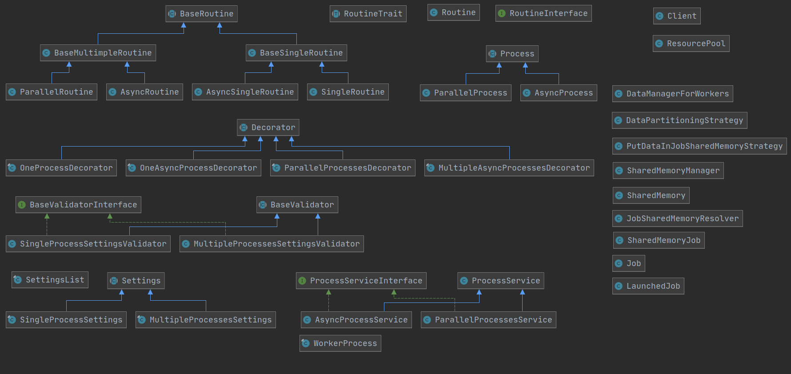

# Введение

Запуск многозадачной обработки во время обработки запроса на сервере.Пакет является встраиваемым.
Работает только на unix подобных OC. Пакет работает с разделяемой памятью unix.

## Пакетом предусмотрены 3 варианта работы:

    - запуск одиночного процесса, отвязывающегося от основного потока вывода(т.е. не требует ожидания,
        в дальнейшем "асинхронным");
    - запуск множества асинхронных процессов;
    - запуск множества процессов, удерживающих поток вывода за управляющим процессом (необходимо для получения данных, 
        записанных каждым отдельным процессом в разделяемую память).

Перечисленные варианты работы применимы как к cgi так и к cli режимам php.
Инициализация приложения выполняется однотипно, за исключением передаваемых параметров.
Приложение принимает одним из параметров конфигурации имя файла php(в котором необходимо расположить
 логику работы данного процесса) относительно положения инициализирующего файла. 

### Инициализация и запуск одиночного асинхронного процесса

#### *Пример*:

```php

Starting::singleAsyncProcess(
    array(
        "jobName" => 'jobs/async_1',
        "shSizeForOneJob" => 300,
        "data" => array(1, 2, 3)
    )
);
```

Starting::singleAsyncProcess принимает массив где:

    "jobName"            - относительный пусть до файла процесса,
    "shSizeForOneJob"    - объем разделяемой памяти в байтах для процесса,
    "data"               - массив с данными передаваемыми в процесс.
    
Логика процесса "jobName" => 'jobs/async_1' находится в файле jobs/async_1.php

```php
require __DIR__ . './vendor/autoload.php';

Job::runSingleAsyncJob(
    $argv,
    function (&$Job, $read) {
        sleep(1);
        $id = posix_getpid();
        $fp = fopen("t{$id}.txt", "w");
        $str = implode(',', $read);
        fwrite($fp, " {$str} \r\n");
        fclose($fp);
    }
);
```

где:

    $argv                       - массив переданных в процесс параметров(является необходимым),
    function (&$Job, $read) {}  - анонимная функция содержащую логику работы процесса c параметрами:
        &$Job - ссылка на объект обработчика задания,
        $read - передаваемые данные из основного процесса.
        
Указанный пример работает следующим образом: 

    1. В основном процессе инициализируется объект для работы с параллельными заданиями.
    2. Для указанного процесса резервируется разделяемая память.
    3. Поток вывода процесса перенаправляется, освобождая поток вывода для основного процесса.
    4. В создавшемся процессе выполняется анонимная функция переданная в Job::runSingleAsyncJob().
    5. По окончанию выполнения основной логики очищается ячейка разделяемой памяти для процесса.
    
### Инициализация и запуск нескольких асинхронных процессов

#### *Пример*:

```php

Starting::multipleAsyncProcesses(
    array(
        array(
            "jobName" => 'jobs/async_1',
            "numberJobs" => 3,
            "shSizeForOneJob" => 300,
            "dataPartitioning" => array(
                "flagPartitioning" => 1,
                "dataToPartitioning" => array(1, 2, 3)
            )
        ),
        array(
            "jobName" => 'jobs/async_2',
            "numberJobs" => 1,
            "shSizeForOneJob" => 300,
            "dataPartitioning" => array(
                "flagPartitioning" => 0,
                "dataToPartitioning" => array('Hi')
            )
        )
    )
);
```

Starting::multipleAsyncProcesses() принимает массив из массивов конфигураций определенного набора процессов, где:

    "jobName" - относительный пусть до файла процесса,
    "numberJobs" - количество одинаковых процессов "jobName" для запуска,
    "shSizeForOneJob"    - объем разделяемой памяти в байтах для каждого процесса,
    "dataPartitioning" - массив определяющий передаваемые данных в каждый процесс:
        параметр "flagPartitioning" - 0 или 1, если "flagPartitioning" = 0, то данные
        поставляются в каждый процесс в указанном виде, иначе если "flagPartitioning" = 1,
        то данные указанные разделяются для количества процессов поровну,
        т.е. если указано "numberJobs" => 3 и "flagPartitioning" => 1,
        то "dataToPartitioning" => array(1, 2, 3) разделится на 3 массива,
        в каждом из которых будет по 1 элементу по порядку и массива array(1, 2, 3).
        Число элементов массива не может быть меньше чем количество процессов.
    
### Инициализация и запуск нескольких процессов, удерживающих поток вывода за управляющим процессом

#### *Пример*:

```php

$parallel =
    Starting::parallel(
        array(
            array(
                "jobName" => 'jobs/job_1',
                "numberJobs" => 1,
                "shSizeForOneJob" => 300,
            ),
            array(
                "jobName" => 'jobs/job_2',
                "numberJobs" => 5,
                "shSizeForOneJob" => 90000,
                "dataPartitioning" => array(
                    "flagPartitioning" => 0,
                    "dataToPartitioning" => ['commit', 'sin']
                )
            ),
            array(
                "jobName" => 'jobs/job_4',
                "numberJobs" => 2,
                "shSizeForOneJob" => 300,
                "dataPartitioning" => array(
                    "flagPartitioning" => 1,
                    "dataToPartitioning" => ['commit', 'sin']
                )
            )
        )
    );

$output = $parallel->getOutput();
```
Starting::parallel() использует такой же набор параметров для инициализации, как и Starting::multipleAsyncProcesses().

Основным отличием Starting::parallel() от Starting::multipleAsyncProcesses() является удержание управления за основным
процессом с ожиданием выполнения дочерних процессов, что позволяет разделять работу "одного процесса" 
на "большее число процессов" с дальнейшим получением данных из каждого параллельного процесса.
Получение данных для основного процесса происходит в строке:

```php
 $output = $parallel->getOutput();
```
## Отладка

Отладка параллельной работы процессов лучше всего доступна в IDE поддерживающей несколько 
одновременных подключений отладчика.

## Рекомендации

Для контроля разделяемой памяти и открытых процессов в debian системах можно использовать 
стоковые утилиты - `ipcs` и `ps` или любые, имеющие схожий функционал. Для использования в режиме
cgi предпочтительно иметь фоновый процесс, следящий за заполнением разделяемой памяти, а так же процесс
для контроля открытых процессов - на случай переполнения оперативной памяти. 


## Package architecture

